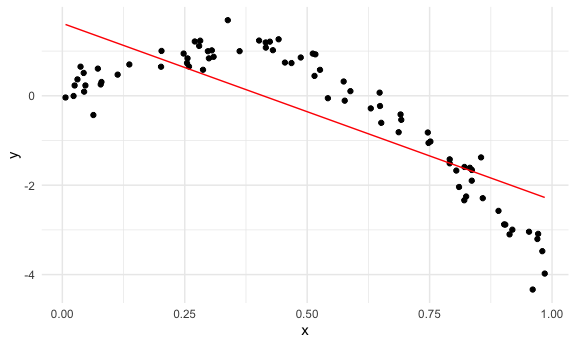
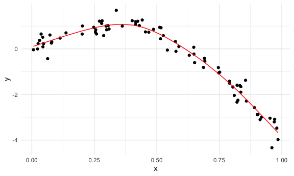

Cross Validation
================
Saryu Patel
11/16/2021

## Simulate Data

``` r
nonlin_df <- 
  tibble(
    id = 1:100,
    x = runif(100, 0, 1),
    y = 1 - 10 * (x - 0.3) ^ 2 + rnorm(100, 0, 0.3)
  )
```

Look at the data.

``` r
nonlin_df %>% 
  ggplot(aes(x = x, y = y)) +
  geom_point()
```


## Cross Validation – By Hand

Get training and testing datasets.

``` r
train_df <- sample_n(nonlin_df, size = 80)
test_df <- anti_join(nonlin_df, train_df, by = "id")
```

Fit three models.

``` r
linear_mod <- lm(y ~ x, data = train_df)
smooth_mod <- gam(y ~ s(x), data = train_df)
wiggly_mod <- gam(y ~ s(x, k = 30), sp = 10e-6, data = train_df)
```

Visualize

``` r
train_df %>% 
  add_predictions(linear_mod) %>% 
  ggplot(aes(x = x, y = y)) +
  geom_point() +
  geom_line(aes(y = pred), color = "red")
```



``` r
train_df %>% 
  add_predictions(smooth_mod) %>% 
  ggplot(aes(x = x, y = y)) +
  geom_point() +
  geom_line(aes(y = pred), color = "red")
```



``` r
train_df %>% 
  add_predictions(wiggly_mod) %>% 
  ggplot(aes(x = x, y = y)) +
  geom_point() +
  geom_line(aes(y = pred), color = "red")
```


``` r
train_df %>% 
  gather_predictions(linear_mod, smooth_mod, wiggly_mod) %>% 
  ggplot(aes(x = x, y = y)) +
  geom_point() +
  geom_line(aes(y = pred), color = "red") +
  facet_grid(. ~ model)
```


Look at prediction accuracy.

``` r
rmse(linear_mod, test_df)
```

    ## [1] 0.7975617

``` r
rmse(smooth_mod, test_df)
```

    ## [1] 0.3164131

``` r
rmse(wiggly_mod, test_df)
```

    ## [1] 0.2617059

## Cross Validation – `modelr`

``` r
cv_df <- 
  crossv_mc(nonlin_df, 100)
```

``` r
cv_df %>% pull(train) %>% .[[1]] %>% as_tibble()
```

    ## # A tibble: 79 × 3
    ##       id      x       y
    ##    <int>  <dbl>   <dbl>
    ##  1     1 0.941  -3.15  
    ##  2     2 0.891  -2.57  
    ##  3     4 0.0353  0.439 
    ##  4     5 0.256   0.838 
    ##  5     8 0.542  -0.0541
    ##  6    10 0.305   1.02  
    ##  7    11 0.687  -0.815 
    ##  8    13 0.248   0.945 
    ##  9    14 0.985  -3.98  
    ## 10    16 0.810  -2.04  
    ## # … with 69 more rows

``` r
cv_df %>% pull(test) %>% .[[1]] %>% as_tibble()
```

    ## # A tibble: 21 × 3
    ##       id       x       y
    ##    <int>   <dbl>   <dbl>
    ##  1     3 0.0991   0.414 
    ##  2     6 0.107    0.927 
    ##  3     7 0.821   -2.34  
    ##  4     9 0.309    0.872 
    ##  5    12 0.804   -1.67  
    ##  6    15 0.338    1.69  
    ##  7    20 0.791   -1.51  
    ##  8    21 0.202    0.649 
    ##  9    22 0.511    0.944 
    ## 10    24 0.00650 -0.0381
    ## # … with 11 more rows

``` r
cv_df <- 
  cv_df %>% 
  mutate(
    train = map(train, as_tibble),
    test = map(test, as_tibble)
  )
```

Fit models and get RMSEs for them.

``` r
cv_df <- 
  cv_df %>% 
  mutate(
    linear_mod = map(train, ~lm(y ~ x, data = .x)),
    smooth_mod = map(train, ~gam(y ~ s(x), data = .x)),
    wiggly_mod = map(train, ~gam(y ~ s(x, k = 30), sp = 10e-6, data = .x))
  ) %>% 
  mutate(
    rmse_linear = map2_dbl(linear_mod, test, ~rmse(model = .x, data = .y)),
    rmse_smooth = map2_dbl(smooth_mod, test, ~rmse(model = .x, data = .y)),
    rmse_wiggly = map2_dbl(wiggly_mod, test, ~rmse(model = .x, data = .y))
  )
```

What do these results say about the model choice?

``` r
cv_df %>% 
  select(starts_with("rmse")) %>% 
  pivot_longer(
    everything(),
    names_to = "model",
    values_to = "rmse",
    names_prefix = "rmse_"
  ) %>% 
  ggplot(aes(x = model, y = rmse)) +
  geom_violin()
```


Compute averages.

``` r
cv_df %>% 
  select(starts_with("rmse")) %>% 
  pivot_longer(
    everything(),
    names_to = "model",
    values_to = "rmse",
    names_prefix = "rmse_"
  ) %>% 
  group_by(model) %>% 
  summarize(avg_rmse = mean(rmse))
```

    ## # A tibble: 3 × 2
    ##   model  avg_rmse
    ##   <chr>     <dbl>
    ## 1 linear    0.901
    ## 2 smooth    0.303
    ## 3 wiggly    0.344

## Try with Real Data

Import data.

``` r
child_growth <-
  read_csv("data/nepalese_children.csv") %>% 
  mutate(weight_cp = (weight > 7) * (weight - 7))
```

    ## Rows: 2705 Columns: 5

    ## ── Column specification ────────────────────────────────────────────────────────
    ## Delimiter: ","
    ## dbl (5): age, sex, weight, height, armc

    ## 
    ## ℹ Use `spec()` to retrieve the full column specification for this data.
    ## ℹ Specify the column types or set `show_col_types = FALSE` to quiet this message.

Weight vs. arm circumference

``` r
child_growth %>% 
  ggplot(aes(x = weight, y = armc)) +
  geom_point(alpha = 0.3)
```


Fit the models.

``` r
linear_mod <- lm(armc ~ weight, data = child_growth)
pwlin_mod <- lm(armc ~ weight + weight_cp, data = child_growth)
smooth_mod <- gam(armc ~ s(weight), data = child_growth)
```

``` r
child_growth %>% 
  gather_predictions(linear_mod, pwlin_mod, smooth_mod) %>% 
  ggplot(aes(x = weight, y = armc)) +
  geom_point(alpha = 0.3) +
  geom_line(aes(y = pred), color = "red") +
  facet_grid(. ~ model)
```


Try to understand model fit using CV.

``` r
cv_df <- 
  crossv_mc(child_growth, 100) %>% 
  mutate(
    train = map(train, as_tibble),
    test = map(test, as_tibble)
    )
```

``` r
cv_df <-  
  cv_df %>% 
  mutate(
    linear_mod = map(train, ~lm(armc ~ weight, data = .x)),
    pwlin_mod = map(train, ~lm(armc ~ weight + weight_cp, data = .x)),
    smooth_mod = map(train, ~gam(armc ~ s(weight), data = .x))) %>% 
  mutate(
    rmse_linear = map2_dbl(linear_mod, test, ~rmse(model = .x, data = .y)),
    rmse_pwlin = map2_dbl(pwlin_mod, test, ~rmse(model = .x, data = .y)),
    rmse_smooth = map2_dbl(smooth_mod, test, ~rmse(model = .x, data = .y)))
```

Violin plot of RMSEs

``` r
cv_df %>% 
  select(starts_with("rmse")) %>% 
  pivot_longer(
    everything(),
    names_to = "model", 
    values_to = "rmse",
    names_prefix = "rmse_") %>% 
  mutate(model = fct_inorder(model)) %>% 
  ggplot(aes(x = model, y = rmse)) + 
  geom_violin()
```


