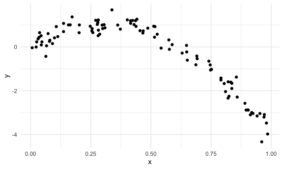

Cross Validation
================
Saryu Patel
11/16/2021

## Simulate Data

``` r
nonlin_df <- 
  tibble(
    id = 1:100,
    x = runif(100, 0, 1),
    y = 1 - 10 * (x - 0.3) ^ 2 + rnorm(100, 0, 0.3)
  )
```

Look at the data.

``` r
nonlin_df %>% 
  ggplot(aes(x = x, y = y)) +
  geom_point()
```



## Cross Validation – By Hand

Get training and testing datasets.

``` r
train_df <- sample_n(nonlin_df, size = 80)
test_df <- anti_join(nonlin_df, train_df, by = "id")
```

Fit three models.

``` r
linear_mod <- lm(y ~ x, data = train_df)
smooth_mod <- gam(y ~ s(x), data = train_df)
wiggly_mod <- gam(y ~ s(x, k = 30), sp = 10e-6, data = train_df)
```

Visualize

``` r
train_df %>% 
  add_predictions(linear_mod) %>% 
  ggplot(aes(x = x, y = y)) +
  geom_point() +
  geom_line(aes(y = pred), color = "red")
```


``` r
train_df %>% 
  add_predictions(smooth_mod) %>% 
  ggplot(aes(x = x, y = y)) +
  geom_point() +
  geom_line(aes(y = pred), color = "red")
```


``` r
train_df %>% 
  add_predictions(wiggly_mod) %>% 
  ggplot(aes(x = x, y = y)) +
  geom_point() +
  geom_line(aes(y = pred), color = "red")
```


``` r
train_df %>% 
  gather_predictions(linear_mod, smooth_mod, wiggly_mod) %>% 
  ggplot(aes(x = x, y = y)) +
  geom_point() +
  geom_line(aes(y = pred), color = "red") +
  facet_grid(. ~ model)
```


Look at prediction accuracy.

``` r
rmse(linear_mod, test_df)
```

    ## [1] 0.8831342

``` r
rmse(smooth_mod, test_df)
```

    ## [1] 0.2503548

``` r
rmse(wiggly_mod, test_df)
```

    ## [1] 0.294147

## Cross Validation – `modelr`

``` r
cv_df <- 
  crossv_mc(nonlin_df, 100)
```

``` r
cv_df %>% pull(train) %>% .[[1]] %>% as_tibble()
```

    ## # A tibble: 79 × 3
    ##       id     x      y
    ##    <int> <dbl>  <dbl>
    ##  1     2 0.425  0.538
    ##  2     3 0.496  0.560
    ##  3     4 0.239  0.556
    ##  4     5 0.373  0.771
    ##  5     6 0.939 -2.51 
    ##  6     7 0.766 -1.37 
    ##  7     8 0.591  0.177
    ##  8    10 0.560  0.666
    ##  9    11 0.526  0.475
    ## 10    13 0.471  0.745
    ## # … with 69 more rows

``` r
cv_df %>% pull(test) %>% .[[1]] %>% as_tibble()
```

    ## # A tibble: 21 × 3
    ##       id     x      y
    ##    <int> <dbl>  <dbl>
    ##  1     1 0.642 -0.450
    ##  2     9 0.657 -0.361
    ##  3    12 0.315  0.681
    ##  4    20 0.191  0.737
    ##  5    31 0.794 -1.46 
    ##  6    32 0.327  0.675
    ##  7    36 0.898 -2.19 
    ##  8    40 0.362  0.813
    ##  9    42 0.504  0.737
    ## 10    43 0.510  1.03 
    ## # … with 11 more rows

``` r
cv_df <- 
  cv_df %>% 
  mutate(
    train = map(train, as_tibble),
    test = map(test, as_tibble)
  )
```

Fit models and get RMSEs for them.

``` r
cv_df <- 
  cv_df %>% 
  mutate(
    linear_mod = map(train, ~lm(y ~ x, data = .x)),
    smooth_mod = map(train, ~gam(y ~ s(x), data = .x)),
    wiggly_mod = map(train, ~gam(y ~ s(x, k = 30), sp = 10e-6, data = .x))
  ) %>% 
  mutate(
    rmse_linear = map2_dbl(linear_mod, test, ~rmse(model = .x, data = .y)),
    rmse_smooth = map2_dbl(smooth_mod, test, ~rmse(model = .x, data = .y)),
    rmse_wiggly = map2_dbl(wiggly_mod, test, ~rmse(model = .x, data = .y))
  )
```

What do these results say about the model choice?

``` r
cv_df %>% 
  select(starts_with("rmse")) %>% 
  pivot_longer(
    everything(),
    names_to = "model",
    values_to = "rmse",
    names_prefix = "rmse_"
  ) %>% 
  ggplot(aes(x = model, y = rmse)) +
  geom_violin()
```


Compute averages.

``` r
cv_df %>% 
  select(starts_with("rmse")) %>% 
  pivot_longer(
    everything(),
    names_to = "model",
    values_to = "rmse",
    names_prefix = "rmse_"
  ) %>% 
  group_by(model) %>% 
  summarize(avg_rmse = mean(rmse))
```

    ## # A tibble: 3 × 2
    ##   model  avg_rmse
    ##   <chr>     <dbl>
    ## 1 linear    0.781
    ## 2 smooth    0.257
    ## 3 wiggly    0.338
